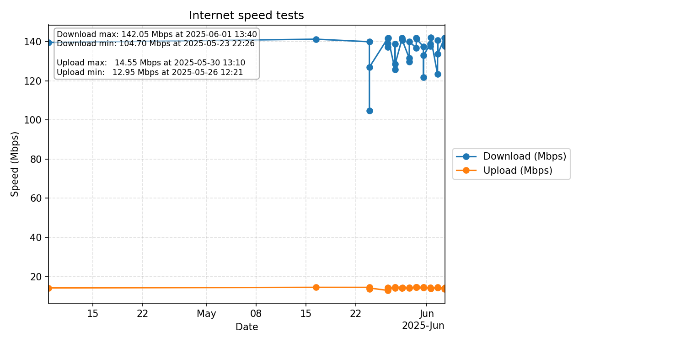

# Internet speed tests

Check your internet speed with [https://github.com/sivel/speedtest-cli](https://github.com/sivel/speedtest-cli). Add a cronjob

```30 7  * * * /home/ubuntu/venv/bin/speedtest-cli --secure --csv  >> /home/ubuntu/speedtest/speedtest.csv```

Then create a graph with Python

```python speedtest.py speedtest.csv```

