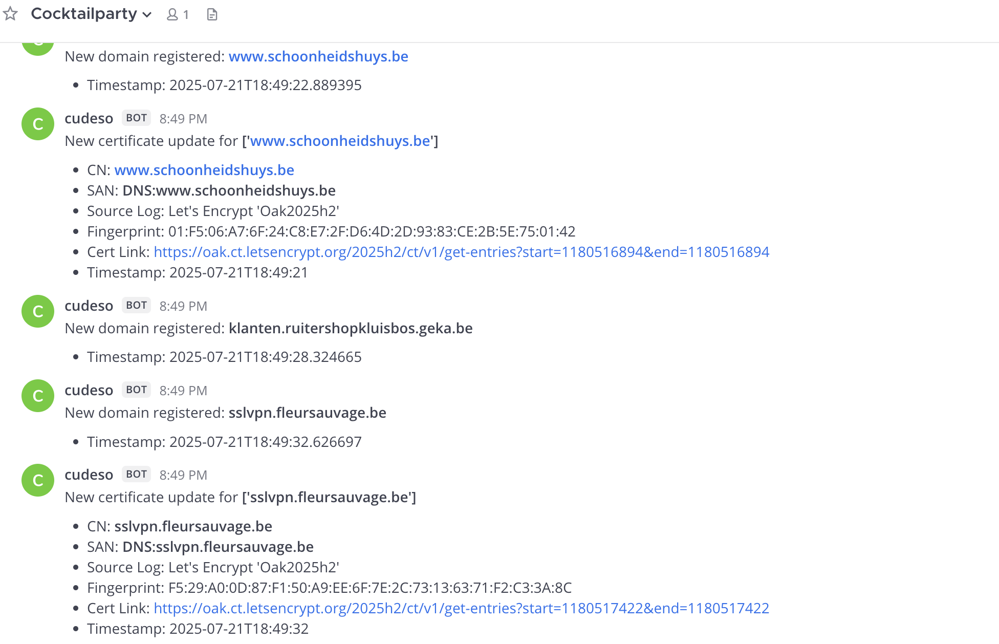

# Cocktailparty

Cocktailparty is the CIRCL **CTI data streaming** platform at [https://cocktailparty.lu/](https://cocktailparty.lu/).

It supports three data streams:

- Certificate Transparency: newly registered certificates
- Certificate Transparency: newly registered domains
- Certificate Transparency: newly registered certificates (full)

You can subscribe to the stream with [websocat](https://github.com/vi/websocat/releases), but I created a small Python script to make filtering data easier.

# Serve a Cocktail

The `serve_cocktail.py` script is a Python client for Cocktailparty. Its main features are:

- **WebSocket subscription**: Connects to the WebSocket API to receive real-time data streams about newly registered certificates and domains.
- **Custom filtering**: Filters incoming certificate and domain events based on user-defined highlight patterns.
- **Notification integration**: Sends filtered results as notifications to a Mattermost channel.
- **Logging**: Writes events and notifications to a local log file.
- **Extensible feeds**: Easily switch between Cocktailparty feeds.

## Configuration

Before running the script, set the following configuration options:

- `COCKTAIL_HIGHLIGHT`: A list of keywords or regex patterns to highlight/filter events (e.g., `[".be$", "bank"]`).
- `MATTERMOST_WEBHOOK`: The URL of your Mattermost webhook for notifications.
- `WS_APIKEY`: Your API key for authenticating with Cocktailparty.
- `WS_JOIN`: The data stream to subscribe to, either `COCKTAIL_CERTIFICATES` or `COCKTAIL_NEW_DOMAINS`.

You can set these variables directly in the script or via environment variables for better security.

**Example:**
```python
COCKTAIL_HIGHLIGHT = [".be$", "bank"]
MATTERMOST_WEBHOOK = "https://mattermost.example.com/hooks/your-webhook-id"
WS_APIKEY = "your-cocktailparty-api-key"
WS_JOIN = COCKTAIL_CERTIFICATES
```

## Run

Typically, I run the script twice: once with `WS_JOIN` set to `COCKTAIL_CERTIFICATES`, and a second time with `WS_JOIN` set to `COCKTAIL_NEW_DOMAINS`.

## Advice

Your filter, defined in `COCKTAIL_HIGHLIGHT`, greatly affects the usefulness of the notifications. If you receive too many notifications, you may start ignoring them. My approach is to:

- Add my customer(s) name as a string
- Add their public domains so I get notified if a new subdomain pops up

## Screenshot

