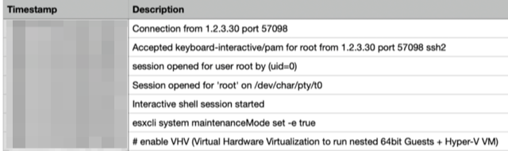
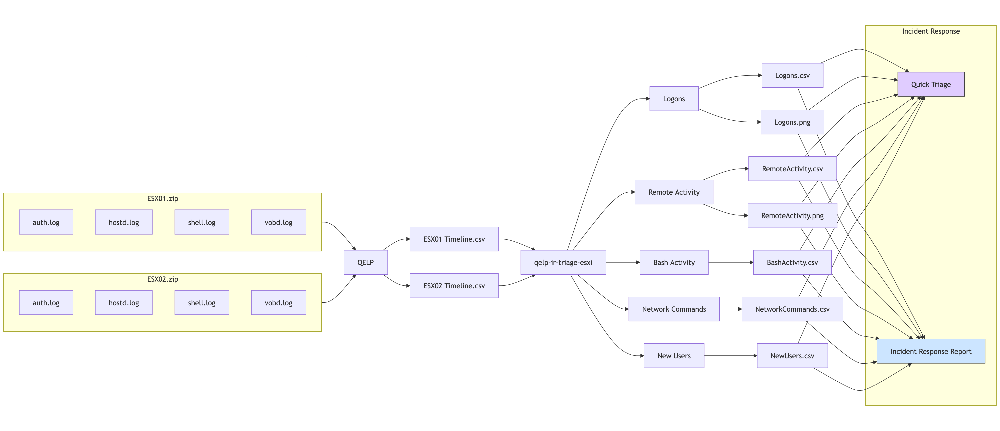
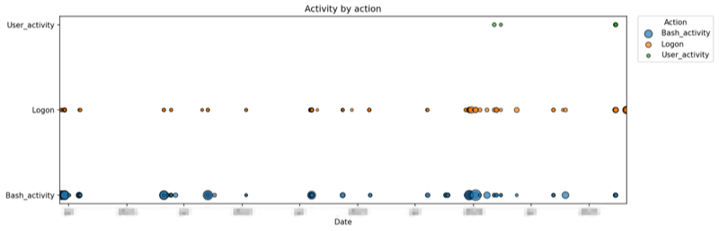
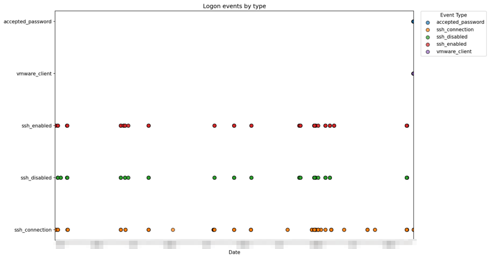
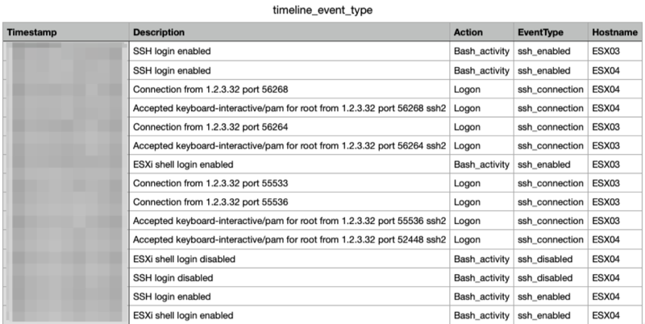
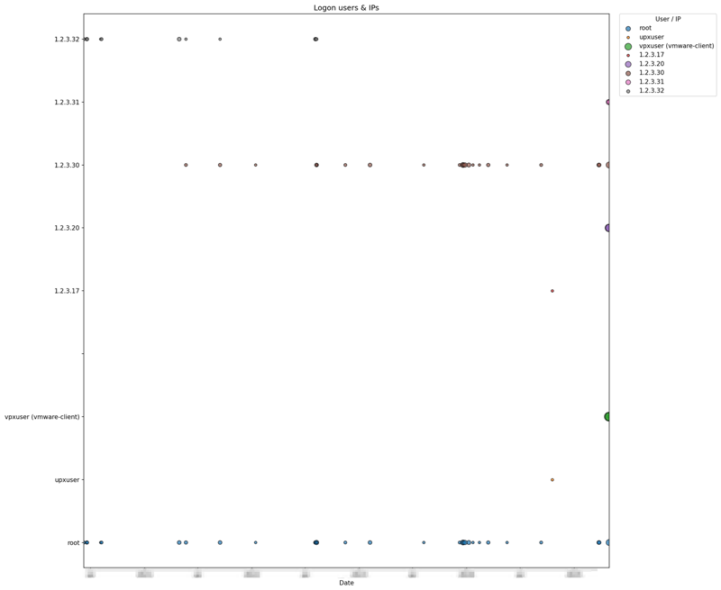
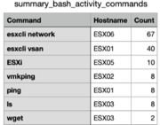
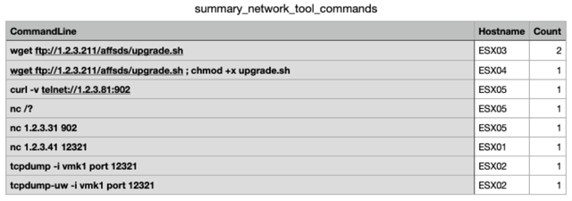
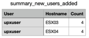

# Incident Response on ESXi

Virtualisation platforms and hypervisors have increasingly become prime targets for attackers. When an ESXi system is compromised, rapid triage and investigation are vital to understand the extent of the incident. The `qelp-ir-triage-esxi.py` script, used in conjunction with QELP—provides a straightforward way to turn ESXi logs into timelines and summaries.

## Quick ESXi Log Parser (QELP)

[QELP](https://github.com/strozfriedberg/qelp), the Quick ESXi Log Parser, is a Python utility that processes ESXi log archives and outputs a timeline in CSV format. Before using QELP, ensure you have [rye](https://rye.astral.sh/) installed.

In this case, we stored the evidence (ZIP files with ESX logs) in  `/home/ubuntu/esxi/evidence/`, and want QELP to write its output into `/home/ubuntu/esxi/case/`:

```bash
rye run qelp /home/ubuntu/esxi/evidence/ /home/ubuntu/esxi/case/
```

You should see a message similar to:

```
2025-05-31 08:48:07,754 esxi_to_csv.py INFO esxi_to_csv main 311 ESXi triage completed in 2 seconds
```

QELP creates a new directory for each evidence file. Inside each of these directories there is a **Timeline.csv** containing timestamped events from the logs.



When ESXi systems have been running for a long period or when you need to review multiple timelines simultaneously the CSV files can be large and cumbersome to analyse manually. That is why I developed a companion script to simplify the parsing.

## qelp-ir-triage-esxi

The `qelp-ir-triage-esxi.py` script ingests one or more **Timeline.csv** files (produced by QELP) and creates:

1. **Bash activity vs. logon vs. user-activity timeline:**
   A plot and CSV table showing dates on which Bash commands were executed, logons occurred, and ESXi shell (user) activity took place.

2. **Logon event timeline by type:**
   A visualisation and CSV of logon-related events.

3. **User/IP logon timeline:**
   A chart and CSV showing which users logged in (and from which IP addresses).

4. **Bash history summary:**
   A CSV of the most frequently used Bash commands.

5. **Network tool usage:**
   A CSV listing commands that involve network tools (`curl`, `wget`, `nc`, `tcpdump`, `ssh`), to spot potential payload downloads.

6. **New user additions:**
   A CSV of new ESXi accounts created via `esxcli system account add`.

All outputs are stored under the directory you specify with `--output`. You can then attach these PNG files and CSV tables to your incident reports.



### Prerequisites

* **Python 3.8+**
* **pandas**
* **matplotlib**
* **rye** (for QELP)
* **QELP** installed via rye

### Usage

Run the script with one or more **Timeline.csv** files and specify an output directory. 

```bash
python qelp-ir-triage-esxi.py \
  --files \
    /home/ubuntu/esxi/case/ESX01.zip_results/Timeline.csv \
    /home/ubuntu/esxi/case/ESX02.zip_results/Timeline.csv \
    /home/ubuntu/esxi/case/ESX03.zip_results/Timeline.csv \
    /home/ubuntu/esxi/case/ESX04.zip_results/Timeline.csv \
    /home/ubuntu/esxi/case/ESX05.zip_results/Timeline.csv \
    /home/ubuntu/esxi/case/ESX06.zip_results/Timeline.csv \
  --output /home/ubuntu/esxi/case/
```

This command will:

1. Parse each specified **Timeline.csv**.
2. Generate multiple PNG graphs (one per analysis section) and corresponding CSV summaries.
3. Print a brief overview of the combined timeline stats.

## Output

After the script finishes, you will see a summary like:

```
==== Global Timeline Stats ====
First entry: 2020-01-01 00:00:00+00:00
Last entry: 2025-05-30 00:00:00+00:00
Number of entries: 1,823
Number of identified hosts: 6
Output written to: /home/ubuntu/esxi/case
```

### Activity timeline

* **Bash\_activity:** Moments when ESXi shell (Bash) commands were executed.
* **Logon:** Events related to remote logons (SSH, VMware-client).
* **User\_activity:** Local ESXi shell enablement or other user-driven actions.

Output: `timeline_activity.png` and `timeline_activity.csv`



Use this to identify spikes in shell usage, as well as unusual logon patterns across multiple hosts.

### Logon event types

* Events categorised as:

  * `ssh_connection` ("Accepted keyboard-interactive/pam" or "Connection from")
  * `ssh_disabled` ("SSH login disabled")
  * `ssh_enabled` ("SSH login enabled")
  * `vmware_client` ("User foo\@1.2.3.4 logged in as VMware-client")
  * `accepted_password` ("Accepted password for from")

Output: `timeline_event_type.png` and `timeline_event_type.csv`




This helps distinguish between different logon mechanism.

### Remote user logon activity

* For each successful login, the script extracts:

  * **User account** (including VMware-client logins)
  * **Source IP address**
  * **Hostname**

Output: `timeline_logon_users_ips.png` and `timeline_logon_users_ips.csv`



Plot points are sized according to the number of logons for a given user or IP on each date.

### Bash history

* Top-level Bash commands (first token of each command line) executed on each ESXi host.
* The summary groups and counts these commands across all hosts.

Output: `summary_bash_activity_commands.csv`



Sort by **Count** to see the most frequently used commands. This highlights suspicious or out-of-place utilities.

### Network commands

* Bash command lines containing network-related utilities (`curl`, `wget`, `nc`, `tcpdump`, `ssh`).
* Can indicate attempts to download malware, establish remote tunnels, or exfiltrate data.

Output: `summary_network_tool_commands.csv`



Search for unexpected downloads or connections that occurred outside of normal maintenance windows.

### New user creation

* ESXi accounts added via `esxcli system account add -i="<username>"`.
* The script extracts the new username and aggregates them by host.

Output: `summary_new_users_added.csv`



Monitor this list for unauthorised accounts.
