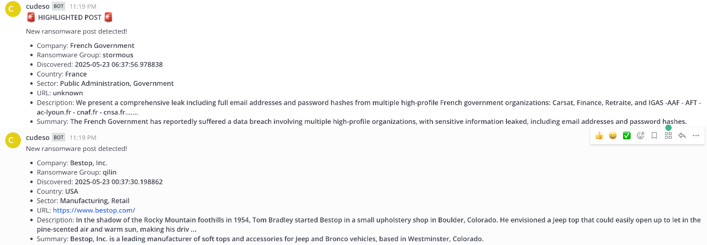
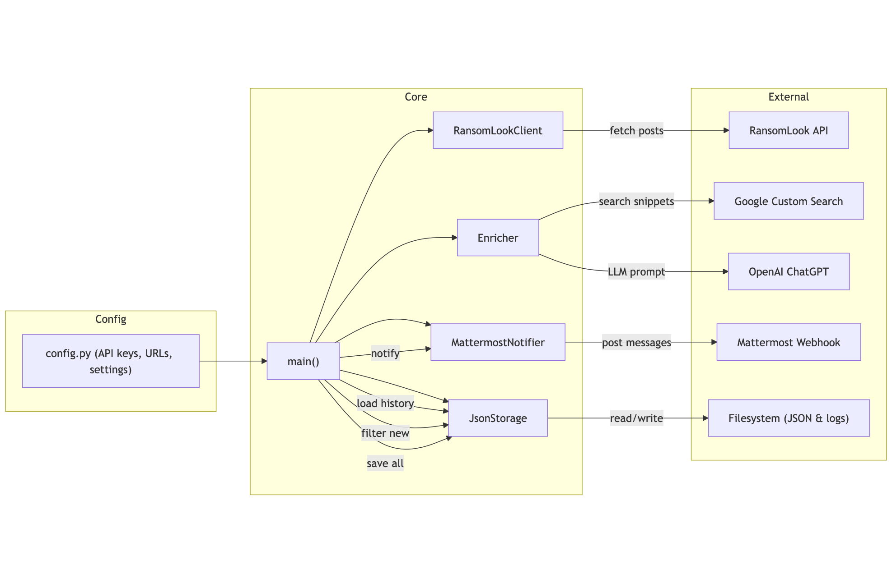

## RansomLook Ticker

**RansomLook Ticker** is a lightweight Python utility that monitors the latest posts from [RansomLook](https://www.ransomlook.io/) (a ransomware gang tracker) and forwards enriched notifications to Mattermost. It leverages:

* The **RansomLook API** for recent incident data
* **Google Custom Search** to gather contextual snippets
* **OpenAI's ChatGPT** to extract structured intelligence (country, sector, etc.)
* **Mattermost webhook** for real-time alerts

This project is ideal if you want:

* Push notifications without hosting a RansomLook instance
* A minimal Retrieval-Augmented Generation (RAG) pipeline
* A foundation for building CTI dashboards or statistical reports

## 🔍 Features

* **Automated polling** of RansomLook’s API for new posts
* **Duplicate detection**: skips already-processed entries
* **Context enrichment** via Google Custom Search
* **Parsing** by ChatGPT to extract:
  * Company name
  * Ransomware group
  * Date discovered
  * Country of victim
  * Sector (single or list)
  * Company URL
  * Brief summary
* **Persistent storage** of results to a JSON file
  * Can also be used for **statistical** purposes
* **Mattermost notifications** with
  * Highlights for specified countries or sectors

## ⚙️ Prerequisites

* Python 3.8 or newer
* A Mattermost channel with an **incoming webhook**
* Google Cloud project with **Custom Search API** enabled
* OpenAI API access

## 🛠️ Installation

Download `ransomlook-ticker.py`, `requirements.txt` and save `config.py.default` as `config.py`.

Create a virtual environment and install dependencies
```bash
python3 -m venv venv
venv/bin/pip install -r requirements.txt
```

## ⚙️ Configuration

Open `config.py` and set the following variables:

   | Variable                 | Description                                  |
   | ------------------------ | -------------------------------------------- |
   | `GOOGLE_API_KEY`         | API key for Google Custom Search             |
   | `GOOGLE_CSE_ID`          | Custom Search Engine ID (cx)                 |
   | `OPENAI_API_KEY`         | Your OpenAI API key                          |
   | `MATTERMOST_WEBHOOK`     | Mattermost incoming webhook URL              |
   | `HIGHLIGHT_TICKER`       | List of sectors or countries to highlight    |

Optional: tweak `PROMPT_TEMPLATE` in `config.py` to refine the ChatGPT query.

## ▶️ Usage

Run the ticker
```bash
venv/bin/python ransomlook-ticker.py
```

* The script will:

  * Fetch new posts from RansomLook
  * Enrich them via Google and ChatGPT
  * Append results to `ransomlook.json`
  * Send formatted alerts to Mattermost
  * Log operations to `ransomlook.log`

## ⏰ Cron job schedule

Install the application as a cron job so you get regular updates. Ideally run the script every 2 or 3 hours.

```
0 */2 * * * cd /home/cti/ransomlookticker ; /home/cti/ransomlookticker/venv/bin/python /home/cti/ransomlookticker/ransomlook-ticker.py
```

## 📸 Screenshot



An extract from the log file:

```
2025-05-17 11:02:18,070 - INFO - Google search results for query 'Selenis (Evertis is also involved)': 5 results
2025-05-17 11:02:20,620 - INFO - HTTP Request: POST https://api.openai.com/v1/chat/completions "HTTP/1.1 200 OK"
2025-05-17 11:02:20,622 - INFO - Skipping already processed post: Carney Badley Spellman
2025-05-17 11:02:20,622 - INFO - Skipping already processed post: freudenberg-cranes.com
2025-05-17 11:02:20,622 - INFO - Skipping already processed post: blainemn.gov
...
2025-05-17 11:02:20,624 - INFO - Skipping already processed post: south african airways (flysaa.com)
2025-05-17 11:02:20,624 - INFO - Skipping already processed post: www.toho.co.jp
2025-05-17 11:02:23,429 - INFO - Successfully posted to Mattermost: Av Alumitran
2025-05-17 11:02:24,199 - INFO - Successfully posted to Mattermost: Murphy Pearson Bradley & Feeney
2025-05-17 11:02:25,603 - INFO - Successfully posted to Mattermost: Franman
2025-05-17 11:02:26,795 - INFO - Successfully posted to Mattermost: Gearhiser Peters Elliott & Cannon, PLLC
2025-05-17 11:02:30,436 - INFO - Successfully posted to Mattermost: Diyar
```

## 🔍 Application flow



## 🗂️ JSON output schema

Each entry in the output JSON file follows this structure:

```json
[
  {
    "post_title": "<original RSS post title>",
    "group_name": "<ransomware group>",
    "discovered": "YYYY-MM-DD",
    "description": "<short description from RSS>",
    "company_name": "<victim company>",
    "country": "<country>",
    "sector": ["<sector1>", "<sector2>"],
    "url": "<detailed incident URL>",
    "summary": "<brief summary from LLM>"
  }
]
```
